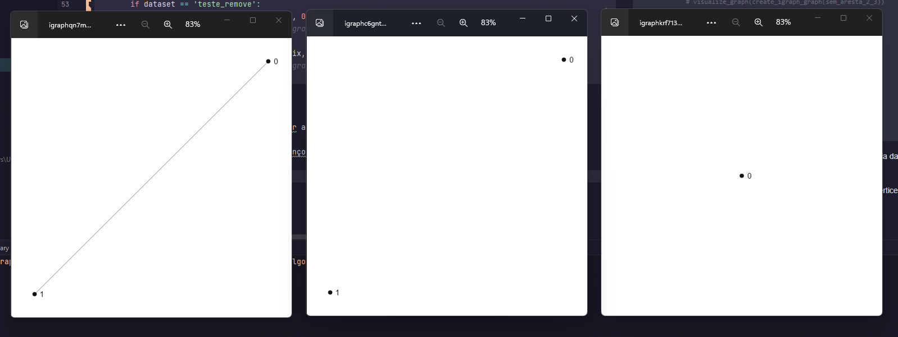

# Algoritmos e Grafos - Relatório de atividade
## Atividade 3 - Grafos, tipos e representações

> Joel Vítor Torres de Andrade Pinto (2021003527)  
> Sistemas de Informação 
> 
> Data máxima de entrega: 12/09

**Para acessar o código disponível no github [clique aqui](https://github.com/joevtap/SIN110-Graph-Algorithms/tree/tarefa02).**

______________________________

A atividade consiste na elaboração de métodos para criação e manipulação de grafos, isso a partir de uma matriz de adjacências.

Usei as bibliotecas **Numpy** e **iGraph**, as quais são especializadas nesse tipo de atividade.

### Detalhamento do código

O arquivo `main.py` agrupa as chamadas dos métodos criados de modo a apresentar alguns exemplos de manipulação dos datasets.

```python
def main(datasets: str):
    for dataset in datasets.split(','):
        matrix, _ = read_instance(dataset)
        print(matrix, end='\n\n')

        graph = create_igraph_graph(matrix)
        print(graph, end='\n\n')

        print('Tipo:', tipoGrafo(matrix))
        print('Densidade:', calcDensidade(matrix))

        if dataset == 'ponte':
            print('Ponte: 2 - 3?', verificaAdjacencia(matrix, 2, 3))
            print('Ponte: 1 - 2?', verificaAdjacencia(matrix, 1, 2))

            ponte_com_4 = insereVertice(matrix, 4)
            print('Ponte: Inserido vertice com id 4: \n', ponte_com_4)
            # visualize_graph(create_igraph_graph(ponte_com_4))

            aresta_1_4 = insereAresta(ponte_com_4, 1, 4)
            print('Ponte: Inserido aresta 1 - 4: \n', aresta_1_4)
            # visualize_graph(create_igraph_graph(aresta_1_4))

            sem_aresta_2_3 = removeAresta(matrix, 2, 3)
            print('Ponte: Removida aresta 2 - 3: \n', sem_aresta_2_3)
            # visualize_graph(create_igraph_graph(sem_aresta_2_3))

            sem_vertice_2 = removeVertice(matrix, 2)
            print('Ponte: Removido vertice 2: \n', sem_vertice_2)
            # visualize_graph(create_igraph_graph(sem_vertice_2))

        if dataset == 'teste_remove':
            sem_aresta = removeAresta(matrix, 0, 1)
            # visualize_graph(create_igraph_graph(sem_aresta))

            sem_vertice = removeVertice(matrix, 0)
            # visualize_graph(create_igraph_graph(sem_vertice))

        # visualize_graph(graph)
```

É possível visualizar um grafo ao descomentar as linhas com a chamada da função `visualize_graph()`.

O exemplo abaixo demonstra a exibição das funções de remoção de vértices e arestas em um grafo simples.



As funções de inserção e remoção foram implementadas em cima de soluções diponibilizadas pela biblioteca **iGraph**, como no exemplo abaixo.

```python
def removeAresta(matriz, vi, vj):
    grafo = create_igraph_graph(matriz)

    grafo.delete_edges(vi, vj)
    return grafo.get_adjacency()
```

Outros exemplos de implementação.

```python
def calcDensidade(matriz):
    graph = create_igraph_graph(matriz)
    v = graph.vcount()
    e = graph.ecount()

    if tipoGrafo(matriz) == 1:
        # Directed
        return round((e / (v * (v - 1))), 3)

    # Undirected
    return round(((2 * e) / (v * (v - 1))), 3)
```

```python
def tipoGrafo(matriz):
    grafo = create_igraph_graph(matriz)

    if any(grafo.is_loop()):
        return 3

    if any(grafo.is_multiple()):
        return 2

    if grafo.is_directed():
        return 1

    if grafo.is_simple():
        return 0
```
